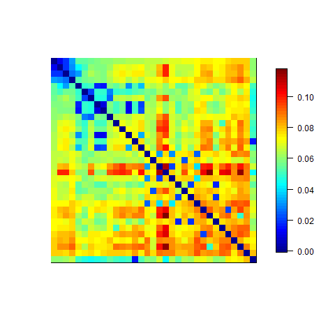
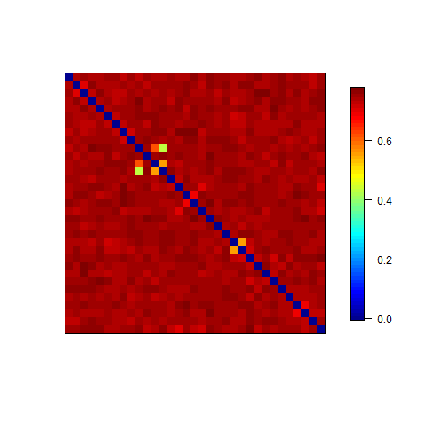
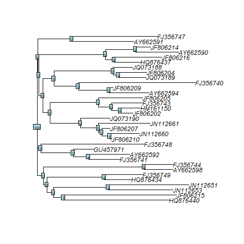
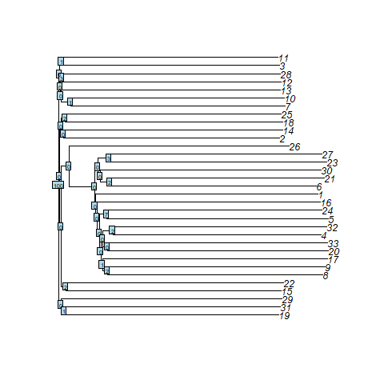

```{r setup, include=FALSE}
knitr::opts_chunk$set(echo = TRUE)
```

# Question 1

```{r, echo=FALSE, eval=TRUE}
library(seqinr)
```

At first, the dataset of the RAG1 gene sequences from 33 lizard species were downloaded from GenBank and saved in a fasta file using the provided R script *732A51 BioinformaticsHT2018 Lab02 GenBankGetCode.R.*. The code can be found in Appendix 1 (Data Import of original dataset).

```{r, echo=FALSE, eval=TRUE}
# reading original_dataset from fasta file 
lizards_sequences = read.fasta("lizard_seqs.fasta")

# preparing data in fasta file (dna sequences include emtpy spaces which will be removed)
for (i in 1:length(lizards_sequences)) {
  lizards_sequences[[i]] = lizards_sequences[[i]][lizards_sequences[[i]] != " "]
}
```

## Question 1.1

The saved fasta-file has to be read in R so that we can work with that. After analysing the sequences, it becomes clear that there can be found many whitespaces (""). Since the artificial sequences should be simulated so that each nucleotide is to be independently and randomly drawn from the distribution given by the base composition in the true
lizard sequences, the whitespaces have to be removed. Otherwise the artificial sequences are built on a probability distribution where the sum of all probabilities would not equal 1. The R code for the reading and preparation process can be found in Appendix 1.1 (Reading and preparing original data).

After preparing the data, the artificial dataset is built by considering that it contains 33 sequences (each length of
the sequences is the same as in the lizard dataset) so that for each real sequence an artificial one is created. As mentioned, the simulation of the artificial sequences is based on the distribution given by the base composition of the original dataset. 

The artificial dataset is submitted as the fasta file *artificial_dataset_1_1.fasta*.
The written function for all these processes automatically prints the base composition in the simulated data compared to the base composition in the original data. An extract from the output can be seen here: 

```{r, echo=FALSE, eval=TRUE}
library(seqinr)
get_artificial_sequence_dataset = function(original_dataset) {
  # creating empty varibales which will be filled in following for-loop
  original_base_compositions = list()
  artificial_dataset = list()
  artificial_base_compositions = list()
  a_original = c(); c_original = c(); g_original = c(); t_original = c()
  a_artificial = c(); c_artificial = c(); g_artificial = c(); t_artificial = c()
  for (i in 1:length(original_dataset)) {
    # getting base compositions for each original sequence
    original_base_compositions[[i]] = 
      seqinr::count(original_dataset[[i]],1)/length(original_dataset[[i]])
    # creating artificial sequences randomly drawn from the distribution 
    # given by the base composition
    artificial_dataset[[as.character(i)]] = sample(x = c("a","c","g","t"),
                                                   size = length(original_dataset[[i]]),
                                                   rep = TRUE,
                                                   prob = original_base_compositions[[i]])
    # creating dataframe to compare base compositions 
    # between original and artificial sequences 
    artificial_base_compositions[[i]] = 
      seqinr::count(artificial_dataset[[i]],1)/length(artificial_dataset[[i]])
    a_original = c(a_original, round(original_base_compositions[[i]][1],2))
    a_artificial = c(a_artificial, round(artificial_base_compositions[[i]][1],2))
    c_original = c(c_original, round(original_base_compositions[[i]][2],2))
    c_artificial = c(c_artificial, round(artificial_base_compositions[[i]][2],2))
    g_original = c(g_original, round(original_base_compositions[[i]][3],2))
    g_artificial = c(g_artificial, round(artificial_base_compositions[[i]][3],2))
    t_original = c(t_original, round(original_base_compositions[[i]][4],2))
    t_artificial = c(t_artificial, round(artificial_base_compositions[[i]][4],2))
  }
  comparison_base_compositions = cbind(
    name_original = names(original_dataset), name_artificial = names(artificial_dataset),
    a_original, a_artificial, c_original, c_artificial, 
    g_original, g_artificial, t_original, t_artificial
  )
  rownames(comparison_base_compositions) = 1:nrow(comparison_base_compositions)
  print("comparison of base compositions between original and artificial datasets (values rounded):")
  print(head(comparison_base_compositions,5))
  # saving fasta file
  ape::write.dna(artificial_dataset, file ="artificial_dataset_1_1.fasta", format = "fasta", colsep = "")
}
```

```{r, echo=TRUE, eval=TRUE}
  get_artificial_sequence_dataset(lizards_sequences)
```

It becomes clear that the base compositions are very similar. 
The entire code for the function can be seen in Appendix 1.1 (Function code).

# Question 1.2

```{r, echo=FALSE, eval=TRUE, message=FALSE}
library(ape)
library(seqinr)
library(phangorn)
```

In this part of the exercise do we use the prepared data from part 1, in  Appendix 1 code can be found in  (Data Import of original dataset).

We used the function *rtree* to create a tree object of the type phylo and the length of the original sequences.
```{r, echo=TRUE, eval=TRUE}
tree <- rtree(n = length(lizards_sequences))
```

Here you can find the plot of the tree.
```{r,echo=FALSE, eval=TRUE, out.width="300px"}
plot(tree, edge.width = 2)
```

After the simulation of the phylogenetic tree, we had to simulate the sequence. 

For this, we the had several things to do. 
1. We simulated a transition rate matrix (Q-Matrix). 
In this case we choose one by yourself. 

```{r,echo=FALSE, eval=TRUE}
transition_matrix <- matrix(0.25, ncol = 4, nrow = 4)
rownames(transition_matrix) <- c("a", "c", "t", "g")
colnames(transition_matrix) <- c("a", "c", "t", "g")
```

```{r, echo=FALSE, eval=TRUE}
transition_matrix
```

2. We had to choose the length of the sequence. 
To make it comparable with the original lizards dataset, we decided to create 

```{r, echo=TRUE, eval=TRUE}
lengths <- c()
for (i in 1:33){
lengths <- c(lengths, length(lizards_sequences[[i]]))
}
```

Now we can use the simulate the sequences by using the function *phangorn::simSeq()*. 

```{r, echo=TRUE, eval=TRUE ,warning=FALSE}
sequences_artificial <- list()
for (j in 1:33){
sequences_artificial[j] <- simSeq(tree, l = lengths[j], Q=transition_matrix , type = "DNA")
}
```

Since in sequences are filled with integers from 1 to 4, do we have to replace the numbers by the letters a,b,c,d.

1 = a 

2 = b

3 = c

4 = d

```{r,echo=FALSE, eval=TRUE}
for (k in 1:33){
sequences_artificial[[k]][sequences_artificial[[k]] == 1] = "a"
sequences_artificial[[k]][sequences_artificial[[k]] == "2"] = "c"
sequences_artificial[[k]][sequences_artificial[[k]] == "3"] = "g"
sequences_artificial[[k]][sequences_artificial[[k]] == "4"] = "t"
}
```

The code for this can be found in Appendix 1.2

The second simulate a artificial DNA sequence dataset do we save as *"artificial_dataset_1_2.fasta"*.
```{r, echo=TRUE, eval=TRUE}
ape::write.dna(sequences_artificial, file ="artificial_dataset_1_2.fasta", format = "fasta", colsep = "", append =FALSE, nbcol = 6, colw = 10)
```

# Question 2

# Question 2.1
```{r}
lizards_sequences = read.fasta("lizard_seqs.fasta")
original_dataset <- lizards_sequences
artificial_sequences_1 <- read.fasta("artificial_dataset_1_1.fasta")
artificial_sequences_2 <- read.fasta("artificial_dataset_1_2.fasta")
original_base_compositions <- list()
artificial_1_base_compositions <- list()
artificial_2_base_compositions <- list()
for (i in 1:length(original_dataset)) {
    # getting base compositions for each original sequence
    original_base_compositions[[i]] = 
      seqinr::count(original_dataset[[i]],1)
}

for (i in 1:length(artificial_sequences_1)) {
    # getting base compositions for each original sequence
    artificial_1_base_compositions[[i]] = 
      seqinr::count(artificial_sequences_1[[i]],1)
}

for (i in 1:length(artificial_sequences_2)) {
    # getting base compositions for each original sequence
    artificial_2_base_compositions[[i]] = 
      seqinr::count(artificial_sequences_2[[i]],1)
}
```

```{r}
Reduce('+', original_base_compositions)
sum(Reduce('+', original_base_compositions))
Reduce('+', original_base_compositions)/sum(Reduce('+', original_base_compositions))

Reduce('+', artificial_1_base_compositions)
sum(Reduce('+', artificial_1_base_compositions))
Reduce('+', artificial_1_base_compositions)/sum(Reduce('+', artificial_1_base_compositions))

Reduce('+', artificial_2_base_compositions)
sum(Reduce('+', artificial_2_base_compositions))
Reduce('+', artificial_2_base_compositions)/sum(Reduce('+', artificial_2_base_compositions))
```

The original dataset and the first artificially created dataset are rather similar in their distributions for A, C, T and G's. However, the second artificially created dataset has a slightly different distribution. This final dataset has almost uniform distribution for A, C, T and G's, they all occur with an average frequency of approximately 25%.

```{r}
library(rDNAse)
original_compositions <- list()
  for (i in 1:length(lizards_sequences)) {
  string1 <- paste(lizards_sequences[[i]], collapse = "")
  string1 <- toupper(string1)
  original_compositions[[i]] <- kmer(string1)
}
```


```{r}
artificial_compositions_1 <- list()
  for (i in 1:length(artificial_sequences_1)) {
  string1 <- paste(artificial_sequences_1[[i]], collapse = "")
  string1 <- toupper(string1)
  artificial_compositions_1[[i]] <- kmer(string1)
}
```

```{r}
artificial_compositions_2 <- list()
  for (i in 1:length(artificial_sequences_2)) {
  string1 <- paste(artificial_sequences_2[[i]], collapse = "")
  string1 <- toupper(string1)
  artificial_compositions_2[[i]] <- kmer(string1)
}
```

```{r}
Reduce('+', original_compositions)
Reduce('+', artificial_compositions_1)
Reduce('+', artificial_compositions_2)
```
GC content is the largest for the second artificially created dataset. CG content is largest for the second artificially created dataset. AT content is largest in the original dataset.

```{r}
# Protein sequences
protein_original <- read.fasta("lizard_protein.fasta")
protein_artificial_1 <- read.fasta("artificial_1_protein.fasta")
protein_artificial_2 <- read.fasta("artificial_2_protein.fasta")
```

```{r, message=FALSE}
library(protr)
original_aac <- list()
for (i in 1:length(protein_original)) {
string1 <- paste(protein_original[[i]], collapse = "")
string1 <- toupper(string1)
string1 <- gsub(pattern = "[*]", replacement = "", x = string1)
string1 <- gsub(pattern = "B", replacement = "", x = string1)
string1 <- gsub(pattern = "J", replacement = "", x = string1)
string1 <- gsub(pattern = "O", replacement = "", x = string1)
string1 <- gsub(pattern = "U", replacement = "", x = string1)
string1 <- gsub(pattern = "X", replacement = "", x = string1)
string1 <- gsub(pattern = "Z", replacement = "", x = string1)
original_aac[[i]] <- extractAAC(string1)
}

```

```{r}
artificial_1_aac <- list()
for (i in 1:length(protein_artificial_1)) {
string1 <- paste(protein_artificial_1[[i]], collapse = "")
string1 <- toupper(string1)
string1 <- gsub(pattern = "[*]", replacement = "", x = string1)
string1 <- gsub(pattern = "B", replacement = "", x = string1)
string1 <- gsub(pattern = "J", replacement = "", x = string1)
string1 <- gsub(pattern = "O", replacement = "", x = string1)
string1 <- gsub(pattern = "U", replacement = "", x = string1)
string1 <- gsub(pattern = "X", replacement = "", x = string1)
string1 <- gsub(pattern = "Z", replacement = "", x = string1)
artificial_1_aac[[i]] <- extractAAC(string1)
}
```

```{r}
artificial_2_aac <- list()
for (i in 1:length(protein_artificial_2)) {
string1 <- paste(protein_artificial_2[[i]], collapse = "")
string1 <- toupper(string1)
string1 <- gsub(pattern = "[*]", replacement = "", x = string1)
string1 <- gsub(pattern = "B", replacement = "", x = string1)
string1 <- gsub(pattern = "J", replacement = "", x = string1)
string1 <- gsub(pattern = "O", replacement = "", x = string1)
string1 <- gsub(pattern = "U", replacement = "", x = string1)
string1 <- gsub(pattern = "X", replacement = "", x = string1)
string1 <- gsub(pattern = "Z", replacement = "", x = string1)
artificial_2_aac[[i]] <- extractAAC(string1)
}
```

```{r}
Reduce('+', original_aac)/length(original_aac)
Reduce('+', artificial_1_aac)/length(artificial_1_aac)
Reduce('+', artificial_2_aac)/length(artificial_2_aac)
```
After removing some unwanted letters and characters, the observed amino acids remain for the obtained protein sequences. Distribution of the amino acids among the three databases of obtained protein sequences is rather similar for all three protein databases.

```{r}
library(seqinr)
library(stringr)

# reading original_dataset from fasta file 
lizards_sequences = read.fasta("lizard_seqs.fasta")
# preparing data in fasta file (dna sequences include emtpy spaces which will be removed)
for (i in 1:length(lizards_sequences)) {
  lizards_sequences[[i]] = lizards_sequences[[i]][lizards_sequences[[i]] != " "]
}
taa_count <- c()
tag_count <- c()
tga_count <- c()

for (i in 1:33){
string <- lizards_sequences[[i]]
string <- paste(lizards_sequences[[i]], collapse = "")
taa_count[i] <-str_count(string, pattern = "taa")
tag_count[i] <- str_count(string, pattern = "tag")
tga_count[i] <- str_count(string, pattern = "tga")
}

names_sequences <- names(lizards_sequences)
df_original <- as.data.frame(cbind(names_sequences, taa_count, tag_count, tga_count, 
                                   total_count_1 = taa_count + tag_count + tga_count))

artificial_sequences_1 <- read.fasta("artificial_dataset_1_1.fasta")
taa_a1 <- c()
tag_a1 <- c()
tga_a1 <- c()
for (i in 1:33){
  string <- artificial_sequences_1[[i]]
  string <- paste(artificial_sequences_1[[i]], collapse = "")
  taa_a1[i] <-str_count(string, pattern = "taa")
  tag_a1[i] <- str_count(string, pattern = "tag")
  tga_a1[i] <- str_count(string, pattern = "tga")
}

names_a1 <- names(artificial_sequences_1)

df_a1 <- as.data.frame(cbind(names_a1, taa_a1, tag_a1, tga_a1, total_count_2 = 
                               taa_a1 + tag_a1 + tga_a1))

artificial_sequences_2 <- read.fasta("artificial_dataset_1_2.fasta")
taa_a2 <- c()
tag_a2 <- c()
tga_a2 <- c()

for (i in 1:33){
  string <- artificial_sequences_2[[i]]
  string <- paste(artificial_sequences_2[[i]], collapse = "")
  taa_a2[i] <-str_count(string, pattern = "taa")
  tag_a2[i] <- str_count(string, pattern = "tag")
  tga_a2[i] <- str_count(string, pattern = "tga")
}

names_a2 <- names(artificial_sequences_1)

df_a2 <- as.data.frame(cbind(names_a2, taa_a2, tag_a2, tga_a2, total_count_3 = 
                               taa_a2 + tag_a2 + tga_a2))

df_all <- as.data.frame(cbind(df_a1, df_a2))
df_all
```
Interpreting stop codons as either "taa", "tag" or "tga" results in many stop codons for each sequence. In the original dataset this is highly unlikely, as a natural translation starts at a start codon and then continues until it reaches a stop codon. Or if it does not reach a stop codon at all.

# Question 2.2

```{r, message=FALSE}
library(markovchain)
mcFitMle_original <- markovchainFit(lizards_sequences, method = "mle")
mcFitMle_original
mcFitMle_a1 <- markovchainFit(artificial_sequences_1, method = "mle")
mcFitMle_a1
mcFitMle_a2 <- markovchainFit(artificial_sequences_2, method = "mle")
mcFitMle_a2
```
We fitted a first order markov model on all sequences. Our assumption in our simulated datasets is that in the sequence the occurence of a nucleotide does not depend on the rest of the sequence.
This violates the limited horizon: which is that the probability of being in a state at time t depends only on the state at time t minus 1. 
We used sample {base}	function, which obviously samples without taking into account past states.

# Question 2.3

To allign the sequences for each dataset (the original dataset *lizards_sequences*, the first artificial dataset *artificial_dataset_1_1* and the second artificial dataset *artificial_dataset_1_2*), the *plsgenomics* package was used. The *.fasta*-files for the datasets were transformed to a *DNAStringSet* - class within R. The uncorrected distance matrices created represent the hamming distance between each of the sequences in each dataset. The results of these distance matrices are plotted as heatmaps (using *plsgenomics* package) :

lizards_sequences
```{r, echo=FALSE, out.width = "200px"}

```

artificial_dataset_1_1
```{r, echo=FALSE, out.width = "200px"}

```

artificial_dataset_1_2
```{r, echo=FALSE, out.width = "200px"}

```

We see that for the original dataset, the allignment results are much better than for the artificial datasets. Based on the point that the artificial datasets were created by sampling randomly, the greater distances between the sequences compared to the distances within the original dataset make sense.

The R code for this Question 2.3 can be found in Appendix 2.3.

# Question 3

## Question 3.1
Using the created distance matrix for each dataset (the original dataset *lizards_sequences*, the first artificial dataset *artificial_dataset_1_1* and the second artificial dataset *artificial_dataset_1_2*) with the aligned sequences, phylotrees were created. On top of that, a phylogenetic bootstrap analysis was performed. As a result, the bootstrap supports for the individual clades were integrated into the phylotrees. 

```{r,echo=FALSE, eval=TRUE, message=FALSE}
library(seqinr)
library(DECIPHER)
library(plsgenomics)
library(ape)

# creating phylotrees
create_phylotree = function(dataset_name) {
  distanceMatrix = readRDS(paste0("distanceMatrix_", dataset_name, ".RDS"))
  tree = nj(distanceMatrix)
  png(paste("phylotree_", dataset_name, ".png", sep=""))
  plot(tree)
  dev.off()
  return(tree)
}
tree_lizards_sequences = create_phylotree("lizards_sequences")
tree_artificial_dataset_1_1 = create_phylotree("artificial_dataset_1_1")
tree_artificial_dataset_1_2 = create_phylotree("artificial_dataset_1_2")
```

lizards_sequences
```{r, echo=FALSE, out.width = "200px"}

```

artificial_dataset_1_1
```{r, echo=FALSE, out.width = "200px"}

```

artificial_dataset_1_2
```{r, echo=FALSE, out.width = "200px"}
knitr::include_graphics("bootstrap_phylotree_artificial_dataset_1_2.png")
```

The R code for the creation of the phylotrees and the bootstrap analysis can be found in Appendix 3.1.

## Question 3.2

Different general characteristics can be comprared between phylogenetic trees, e.g.:

- number of tips
- different tips
- number of nodes

On top of that, different quantitative distances can be calculated, e.g.:

- symmetric difference
- branch score

The distances can be only calculated if the tips are named equally. Since the artificial datasets (*artificial_dataset_1_1* and *artificial_dataset_1_2*) are not named as the original dataset (*lizard_sequences*), the distance measurements could be only processed for the comparison between the artficial datasets.

```{r, echo=FALSE, eval=TRUE}
library(phangorn)
compare_phylotrees = function(phylotree1, phylotree2) {
  if(all(phylotree1$tip.label == phylotree2$tip.label)) {
    comparePhylo(phylotree1, phylotree2)
    treedist(phylotree1, phylotree2)
  } else {
    comparePhylo(phylotree1, phylotree2)
  }
}
```

```{r, echo=FALSE, eval=TRUE}
compare_phylotrees(tree_lizards_sequences, tree_artificial_dataset_1_1)
```

```{r, echo=FALSE, eval=TRUE}
# Comparing tree_lizards_sequences & tree_artificial_dataset_1_2
compare_phylotrees(tree_lizards_sequences, tree_artificial_dataset_1_2)
```

```{r, echo=FALSE, eval=TRUE}
# Comparing tree_artificial_dataset_1_1 & tree_artificial_dataset_1_2
compare_phylotrees(tree_artificial_dataset_1_1, tree_artificial_dataset_1_2)
```

----------------------------------------------------------------------------------------------
# Appendix 1

Data Import of original dataset
```{r, echo=TRUE, eval=FALSE}
library(ape)
lizards_accession_numbers <- c("JF806202", "HM161150", "FJ356743", "JF806205", 
                               "JQ073190", "GU457971", "FJ356741", "JF806207",
                               "JF806210", "AY662592", "AY662591", "FJ356748",       
                               "JN112660", "AY662594", "JN112661", "HQ876437", 
                               "HQ876434", "AY662590", "FJ356740", "JF806214", 
                               "JQ073188", "FJ356749", "JQ073189", "JF806216", 
                               "AY662598", "JN112653", "JF806204", "FJ356747", 
                               "FJ356744", "HQ876440", "JN112651", "JF806215",
                               "JF806209") 
lizards_sequences<-ape::read.GenBank(lizards_accession_numbers)
print(lizards_sequences)
ape::write.dna(lizards_sequences, 
               file ="lizard_seqs.fasta", 
               format = "fasta", 
               append =FALSE, 
               nbcol = 6, 
               colsep = " ", 
               colw = 10)
```

## Appendix 1.1

Reading and preparing original data
```{r, echo=TRUE, eval=FALSE}
library(seqinr)
# reading original_dataset from fasta file 
lizards_sequences = read.fasta("lizard_seqs.fasta")

# preparing data in fasta file (dna sequences include emtpy spaces which will be removed)
for (i in 1:length(lizards_sequences)) {
  lizards_sequences[[i]] = lizards_sequences[[i]][lizards_sequences[[i]] != " "]
}
```

Function code
```{r, echo=TRUE, eval=FALSE}
library(seqinr)
get_artificial_sequence_dataset = function(original_dataset) {
  # creating empty varibales which will be filled in following for-loop
  original_base_compositions = list()
  artificial_dataset = list()
  artificial_base_compositions = list()
  a_original = c(); c_original = c(); g_original = c(); t_original = c()
  a_artificial = c(); c_artificial = c(); g_artificial = c(); t_artificial = c()
  for (i in 1:length(original_dataset)) {
    # getting base compositions for each original sequence
    original_base_compositions[[i]] = 
      seqinr::count(original_dataset[[i]],1)/length(original_dataset[[i]])
    # creating artificial sequences randomly drawn from the distribution 
    # given by the base composition
    artificial_dataset[[as.character(i)]] = sample(x = c("a","c","g","t"),
                                                   size = length(original_dataset[[i]]),
                                                   rep = TRUE,
                                                   prob = original_base_compositions[[i]])
    # creating dataframe to compare base compositions 
    # between original and artificial sequences 
    artificial_base_compositions[[i]] = 
      seqinr::count(artificial_dataset[[i]],1)/length(artificial_dataset[[i]])
    a_original = c(a_original, round(original_base_compositions[[i]][1],2))
    a_artificial = c(a_artificial, round(artificial_base_compositions[[i]][1],2))
    c_original = c(c_original, round(original_base_compositions[[i]][2],2))
    c_artificial = c(c_artificial, round(artificial_base_compositions[[i]][2],2))
    g_original = c(g_original, round(original_base_compositions[[i]][3],2))
    g_artificial = c(g_artificial, round(artificial_base_compositions[[i]][3],2))
    t_original = c(t_original, round(original_base_compositions[[i]][4],2))
    t_artificial = c(t_artificial, round(artificial_base_compositions[[i]][4],2))
  }
  comparison_base_compositions = cbind(
    name_original = names(original_dataset), name_artificial = names(artificial_dataset),
    a_original, a_artificial, c_original, c_artificial, 
    g_original, g_artificial, t_original, t_artificial
  )
  rownames(comparison_base_compositions) = 1:nrow(comparison_base_compositions)
  print("comparison of base compositions 
        between original and artificial datasets (values rounded): ")
  print(comparison_base_compositions)
  # saving fasta file
  ape::write.dna(artificial_dataset, file ="artificial_dataset_1_1.fasta", format = "fasta", 
                 colsep = "")
}
```

## Appendix 1.2
Replace the integers by letters
```{r,echo=TRUE, eval=FALSE}
for (k in 1:33){
sequences_artificial[[k]][sequences_artificial[[k]] == 1] = "a"
sequences_artificial[[k]][sequences_artificial[[k]] == "2"] = "c"
sequences_artificial[[k]][sequences_artificial[[k]] == "3"] = "g"
sequences_artificial[[k]][sequences_artificial[[k]] == "4"] = "t"
}
```

# Appendix 2

## Appendix 2.3

```{r,echo=TRUE, eval=FALSE}
library(seqinr)
library(DECIPHER)
library(plsgenomics)
library(ape)

# getting all datasets in DNAStringSet format

  # original dataset
    # readAAStringSet-function needs path of fasta file as input. The original 
    # dataset needs to be prepared and saved so that the fasta file does not 
    # inlcude whitespaces anymore.
      # reading original_dataset from fasta file 
      lizards_sequences = read.fasta("lizard_seqs.fasta")
      # preparing data in fasta file (dna sequences include emtpy spaces which will be removed)
      for (i in 1:length(lizards_sequences)) {
        lizards_sequences[[i]] = lizards_sequences[[i]][lizards_sequences[[i]] != " "]
      }
      # saving prepared fasta file
      ape::write.dna(lizards_sequences, file ="lizards_sequences_no_whitespaces.fasta", 
                     format = "fasta", colsep = "")
    # reading prepared fasta file as biostrings-object
    lizards_sequences = readDNAStringSet("lizards_sequences_no_whitespaces.fasta")
    
  # artificial_dataset_1_1
  artificial_dataset_1_1 = readDNAStringSet("artificial_dataset_1_1.fasta")
    
  # artificial_dataset_1_2
  artificial_dataset_1_2 = readDNAStringSet("artificial_dataset_1_2.fasta")
  
# alligning sequences for each dataset
sequence_alligning = function(dataset, name) {
  # alligning process
  sequences_alligned = AlignSeqs(dataset)
  # creating distance matrix
  dm_sequences_alligned = DistanceMatrix(sequences_alligned)
  # creating matrix heatmap
  heatmap_dm_sequences_alligned = matrix.heatmap(dm_sequences_alligned)
  dev.copy(png,paste("heatmap_", name, ".png", sep=""))
  dev.off()
  return(sequences_alligned)
}

lizards_sequences_alligned = sequence_alligning(dataset = lizards_sequences, 
                                                name = "lizards_sequences")
artificial_dataset_1_1_alligned = sequence_alligning(artificial_dataset_1_1, 
                                                     name = "artificial_dataset_1_1")
artificial_dataset_1_2_alligned = sequence_alligning(artificial_dataset_1_2, 
                                                     name = "artificial_dataset_1_2")
```

# Appendix 3

## Appendix 3.1
```{r,echo=TRUE, eval=FALSE}
library(seqinr)
library(DECIPHER)
library(plsgenomics)
library(ape)

# creating phylotrees
create_phylotree = function(dataset_name) {
  distanceMatrix = readRDS(paste0("distanceMatrix_", dataset_name, ".RDS"))
  tree = nj(distanceMatrix)
  png(paste("phylotree_", dataset_name, ".png", sep=""))
  plot(tree)
  dev.off()
  return(tree)
}
tree_lizards_sequences = create_phylotree("lizards_sequences")
tree_artificial_dataset_1_1 = create_phylotree("artificial_dataset_1_1")
tree_artificial_dataset_1_2 = create_phylotree("artificial_dataset_1_2")

# performing bootstrap analysis
bootstrap_analysis = function(dataset_name, tree_object) {
  distanceMatrix = readRDS(paste0("distanceMatrix_", dataset_name, ".RDS"))
  bootstrap_result = boot.phylo(phy = tree_object,
                                x = distanceMatrix,
                                FUN = function(x) {
                                  nj(x)
                                })
  png(paste("bootstrap_phylotree_", dataset_name, ".png", sep=""))
  plot(tree_object)
  nodelabels(bootstrap_result, cex=.6)
  dev.off()
}
bootstrap_analysis("lizards_sequences", tree_lizards_sequences)
bootstrap_analysis("artificial_dataset_1_1", tree_artificial_dataset_1_1)
bootstrap_analysis("artificial_dataset_1_2", tree_artificial_dataset_1_2)
```

## Appendix 3.2

```{r,echo=TRUE, eval=FALSE}
library(phangorn)
compare_phylotrees = function(phylotree1, phylotree2) {
  if(all(phylotree1$tip.label == phylotree2$tip.label)) {
    comparePhylo(phylotree1, phylotree2)
    treedist(phylotree1, phylotree2)
  } else {
    comparePhylo(phylotree1, phylotree2)
  }
}
# Comparing tree_lizards_sequences & tree_artificial_dataset_1_1
compare_phylotrees(tree_lizards_sequences, tree_artificial_dataset_1_1)
# Comparing tree_lizards_sequences & tree_artificial_dataset_1_2
compare_phylotrees(tree_lizards_sequences, tree_artificial_dataset_1_2)
# Comparing tree_artificial_dataset_1_1 & tree_artificial_dataset_1_2
compare_phylotrees(tree_artificial_dataset_1_1, tree_artificial_dataset_1_2)
```